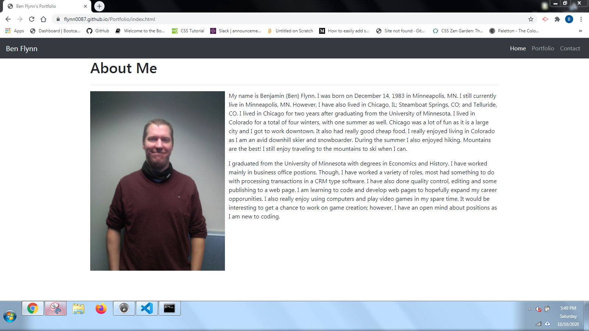

# Portfolio

## Description

This is a personal page that has details about me. It also showcases the work I have done developing webpages. It also contains methods to contact me, via email and linkedin.

## Installation

No installation beyond a web browser should be needed to view the webpage. A code editor such as visual studio is required to view the code.

## Usage

This webpage is viewable at: https://flynn0087.github.io/Portfolio/
Here is an example image of the page: 

## Contributing

As this is my portfolio page I used a more restrictive license. However, pull requests and advice are welcome. For major changes please create an issue first about the changes to be made.

## Credits

https://www.w3schools.com/
https://stackoverflow.com/

## License

GNU General Public License v3.0 (https://choosealicense.com/licenses/gpl-3.0/)
